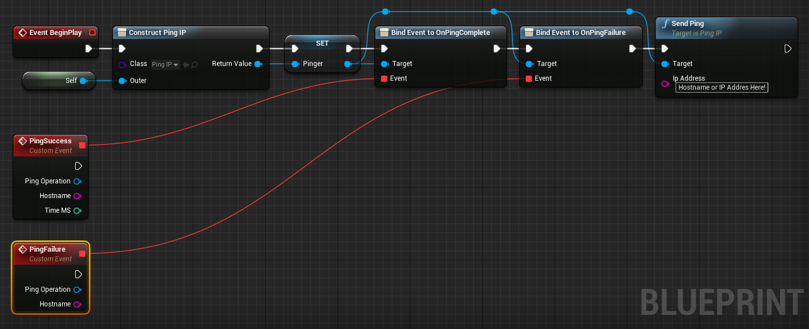

Version Update 4.21 to 4.25 

# Ping

## An Unreal Engine 4 project plugin by Descendent Studios

### Usage

Ping will need to be built before it can be used.  Your UE4 editor *should* detect that it needs to do the build.  Otherwise, you'll need to recompile your game project.

Pinging a host is easy.  Create a PingIP object, then bind events to OnPingComplete and OnPingFailure.  Then Call SendPing() on your host, either by hostname or IPv4 address (IPv6 is not currently supported, since UE4 does server join over IPv4).

That's it!  When the ping thread has completed, the event bound to OnPingComplete or OnPingFailure will be called, depending on whether an echo was received.

It is important to note that to run simultaneous pings, different PingIP objects will need to created.  For example, in Descent: Underground, each match listing in the match browser has its own PingIP object.

### Q&A

#### Why is the name just "Ping"?

Pixley isn't very creative when it comes to naming things.  It's the ping plugin.  Thus the name of the plugin ended up as "Ping".

#### Why do the Mac and Linux versions use "ping" from the shell?

Making an ICMP_ECHO request from a user process is made effectively impossible on many Linux distros.  It can be done, but it requires user modification, and that is not desirable when the user is just trying to play a video game.  Mac uses the same code as Linux, since they're both more-or-less POSIX-compliant.  Means we had to write one less pathway.
